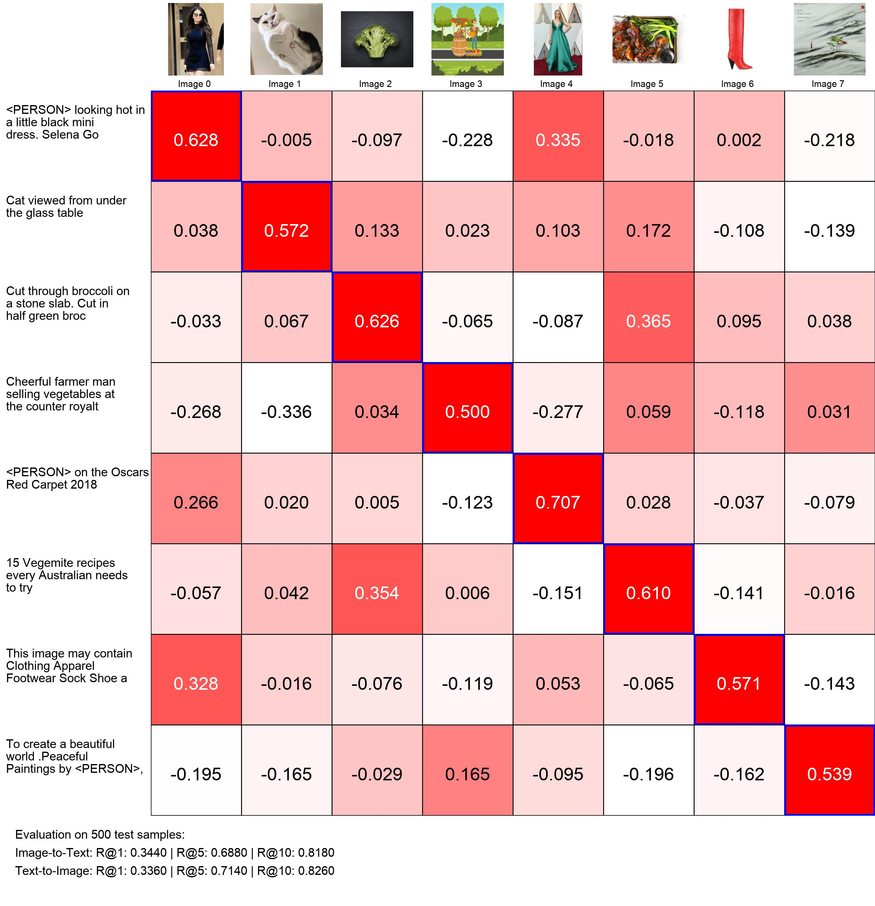

# Vision-Language Model (VLM) Training

A PyTorch implementation for training vision-language models from scratch using Q-Former architecture and small language models. This project demonstrates how to build a complete VLM pipeline that can understand and describe images.


## Overview

This project implements a vision-language model training pipeline that:

1. **Trains a Q-Former** to align visual and text embeddings using contrastive learning (CLIP-style)
2. **Adapts a pretrained language model** (SmolLM or Qwen) to understand visual inputs through the trained Q-Former
3. **Enables image captioning and visual question answering** with lightweight models suitable for consumer hardware

The architecture uses:
- **Vision Transformer (ViT)** for encoding images
- **Q-Former** (Query Transformer) to compress and align visual features with text
- **Small Language Models** (SmolLM-135M or Qwen3-0.6B) with LoRA fine-tuning
- **Conceptual Captions dataset** for training

## Architecture


The diagram above shows the complete end-to-end architecture:

1. **Image Processing**: Input images are encoded by ViT into patch embeddings
2. **Q-Former**: Compresses ViT embeddings into a fixed number of query tokens
3. **MLP Adapter**: Projects Q-Former outputs into the language model's embedding space
4. **Text Input**: User prompt (e.g., "Describe this image") is tokenized
5. **Concatenation**: Image tokens and text tokens are combined into a single sequence
6. **Language Model**: Decoder layers (with LoRA adapters) generate the caption autoregressively

This 2-stage training approach first aligns vision and language representations (Q-Former), then teaches the LLM to understand visual inputs (full VLM).

## Project Structure

```
vlm/
├── vlm_train/                    # Main training directory
│   ├── datasets/                 # Data loading modules
│   │   ├── cc_dataloader.py     # Conceptual Captions dataloader
│   │   └── lm_dataloader.py     # Language model dataloader
│   ├── networks/                 # Neural network architectures
│   │   ├── q_former.py          # Q-Former implementation
│   │   └── lm_to_vlm.py         # VLM wrapper with LoRA
│   ├── utils/                    # Utility functions
│   │   ├── calculate_recall.py  # Retrieval metrics (I2T, T2I)
│   │   ├── utils.py             # Visualization utilities
│   │   └── filter_dataset.py    # Dataset preparation script
│   ├── q_former_train.py        # Q-Former training script
│   ├── lm_train.py              # VLM fine-tuning script
│   ├── test_generation.py       # Generation evaluation script
│   └── basic_inference.py       # Inference and metrics visualization
├── inference_results/            # Output directory for results
│   └── similarity_grid.jpg      # Image-text retrieval visualization
└── requirements.txt             # Project dependencies
```

## Installation

### Prerequisites
- Python >= 3.12
- CUDA-capable GPU recommended (can also run on MPS/CPU)
- ~10GB disk space for dataset

### Steps

1. **Clone the repository**
```bash
git clone https://github.com/avbiswas/vlm.git
cd vlm
```

2. **Install dependencies**

```bash
pip install -r requirements.txt
```


3. **Download the dataset**

Run the filter script to download Conceptual Captions:
```bash
python vlm_train/utils/filter_dataset.py
```

This will download ~200k image-caption pairs to `dataset/conceptual-captions-200k.parquet`.

4. **Download images using img2dataset**

```bash
img2dataset --url_list dataset/conceptual-captions-200k.parquet \
            --input_format "parquet" \
            --url_col "image_url" \
            --caption_col "caption" \
            --output_folder dataset/cc_images \
            --processes_count 16 \
            --thread_count 64 \
            --image_size 224 \
            --resize_mode center_crop
```

## Training

### Stage 1: Train Q-Former (Vision-Language Alignment)

The Q-Former learns to align visual features from ViT with text embeddings from DistilBERT using contrastive learning:

```bash 
python vlm_train/q_former_train.py
```

**Key hyperparameters:**
- Learning rate: 1e-4 (default), 1e-3 (cross-attention & queries)
- Batch size: 8
- Loss: CLIP-style contrastive loss
- Device: Auto-detected (CUDA/MPS/CPU)

The trained model will be saved to `models/trained_qformer/best/`.

### Stage 2: Train Vision-Language Model

Fine-tune a language model to understand visual inputs through the trained Q-Former:

```bash
python vlm_train/lm_train.py
```

**Key hyperparameters:**
- Model: SmolLM-135M-Instruct (default) or Qwen3-0.6B
- Learning rate: 1e-4 (Q-Former), 5e-4 (adapter + LLM LoRA)
- Batch size: 8 with gradient accumulation (4 steps)
- LoRA config: r=64, alpha=128
- Mixed precision: bfloat16

Models are saved to `models/vlm_peft/best/` and `models/vlm_peft/latest/`.

## Evaluation and Testing

### Generate Captions

Test the model on evaluation samples:

```bash
python vlm_train/test_generation.py
```

This generates captions for samples 130-160 and saves results to `test_generation_results.csv`.

### Compute Retrieval Metrics

Run inference to compute image-to-text and text-to-image retrieval metrics:

```bash
python vlm_train/basic_inference.py
```

This generates:
- **Recall@K metrics** (K=1, 5, 10) for both I2T and T2I retrieval
- **Similarity grid visualization** saved to `inference_results/similarity_grid.jpg`

## Results

### Q-Former Retrieval Performance

Below is an example similarity grid showing image-text retrieval performance on 8 test samples:



The grid shows:
- **Rows**: Text captions
- **Columns**: Images
- **Cell values**: Cosine similarity between image and text embeddings

**Retrieval Performance:**
- Image-to-Text: High recall indicates the model can find correct captions for images
- Text-to-Image: High recall indicates the model can find correct images for captions

### VLM Caption Generation

Below are examples of captions generated by the trained Vision-Language Model on test images:


The model demonstrates the ability to:
- **Describe visual content**: Objects, scenes, and settings in images
- **Generate coherent captions**: Natural language descriptions that relate to the image content
- **Handle diverse images**: From landscapes and architecture to products and people

Each image is paired with a generated caption (shown in green), demonstrating the model's vision-language understanding capabilities after the 2-stage training process.

> **Note:** This project was created for the YouTube tutorial, focusing on educational clarity over scale. The model was trained on just **50,000 image-caption pairs** (a small subset of Conceptual Captions) and the entire 2-stage training process completed in approximately **4 hours** on a single GPU. Despite the limited data and training time, the model demonstrates meaningful vision-language understanding, making this an accessible starting point for learning VLM development.

## Model Architecture

### Q-Former
- Based on DistilBERT architecture
- 32 learnable query tokens to compress visual information
- Cross-attention layers to attend to ViT features
- Outputs aligned visual and text embeddings for contrastive learning

### Vision-Language Model
- **Vision Encoder**: ViT-base-patch16-224 (frozen)
- **Q-Former**: Trained from Stage 1 (fine-tuned)
- **Adapter**: 2-layer MLP to project Q-Former outputs to LLM space
- **Language Model**: SmolLM-135M with LoRA (r=64) on all linear layers

## Future Work and Improvements

- **Config-driven development**: Most hyperparameters, model paths, and training settings are currently hardcoded in the training scripts. Extracting these into YAML/JSON config files would make experimentation much easier and reduce code duplication
- **Experiment tracking**: Integrate with Weights & Biases or MLflow for better experiment tracking and visualization
- **Data augmentation**: Add image augmentations to improve model robustness
- **Larger training runs**: Scale up to the full Conceptual Captions dataset or use other datasets like LAION
- **Better evaluation metrics**: Add BLEU, CIDEr, and other standard image captioning metrics
- **Model checkpointing**: Implement better checkpoint management and resume-from-checkpoint functionality

## Acknowledgments

- BLIP-2 paper for Q-Former architecture inspiration
- Hugging Face for transformers library and model hosting
- Conceptual Captions dataset creators
